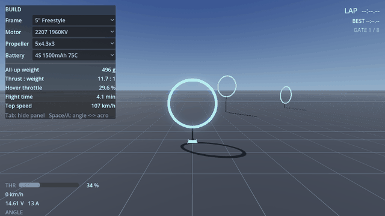

# Lothal

**Build an FPV drone from real parts. Fly it. Feel the difference.**



Lothal is a drone design workbench and flight simulator. You assemble a quadcopter from a
catalog of real components — frames, motors, propellers, batteries, ESCs, flight controllers —
and every choice changes the physics. Swap a 4S pack for 6S and the thrust-to-weight, hover
throttle and flight time all recompute; then you fly it and feel the difference.

Nothing is a canned asset. Prop rotation is integrated from actual RPM, voltage sag is computed
from the pack's internal resistance and the current the motors are really drawing, and the
flight model runs at 1 kHz off measured manufacturer thrust data.

---

## ⚠️ Beta — under active development

**Lothal is pre-1.0 and should be treated as a beta.** It is usable and the physics is real, but
the software is young and the rough edges are not evenly distributed. Specifically:

- **Not signed** by Apple or Microsoft. macOS and Windows will both warn you.
  [What the warning means](#about-the-security-warnings).
- **Saved builds and flight logs may not survive an upgrade.** The on-disk formats are still
  changing between releases, and there is no migration path yet. Do not treat Lothal as the only
  copy of anything you care about.
- **Component data is verified against manufacturer sources but the catalog is small.** If a part
  you own is missing, that is expected at this stage.
- **Interfaces will change.** Panels, controls and file layouts are still moving.

None of this makes the simulation less honest — the flight model is the part that gets the most
scrutiny. It means the software around it is still settling. Bug reports are genuinely useful
right now; see [Feedback](#feedback).

---

## Download

Current release: **v0.2.0** — macOS 11+ (Universal, Intel and Apple Silicon), Windows 10/11 x64, and Linux x86-64.

The block below downloads the release, checks it against the published SHA-256, and installs it.
Paste the whole thing; it is written to stop rather than continue if the checksum does not match.

The macOS block resolves the current version by itself, so it does not go stale — the same
command installs today's release and upgrades you to tomorrow's. It asks for your password
because writing to `/Applications` requires it.

### macOS

```bash
set -e
cd "$(mktemp -d)"
ZIP_URL=$(curl -fsSLI -o /dev/null -w '%{url_effective}' https://dl.meetdev.in/latest/macos)
VER=$(echo "$ZIP_URL" | sed -n 's#.*/v\([^/]*\)/.*#\1#p')
[ -n "$VER" ] || { echo "could not resolve the current version"; exit 1; }
ZIP="Lothal-$VER-macos-universal.zip"
curl -fLO "https://dl.meetdev.in/v$VER/$ZIP"
curl -fLO "https://dl.meetdev.in/v$VER/SHA256SUMS.txt"
shasum -a 256 -c --ignore-missing SHA256SUMS.txt || { echo "CHECKSUM FAILED — do not open it"; return 2>/dev/null || exit 1; }
sudo ditto -x -k "$ZIP" /Applications
sudo xattr -dr com.apple.quarantine /Applications/Lothal.app
open /Applications/Lothal.app
```

Use `ditto`, not the Finder or `unzip`, to unpack it. `ditto` is how the archive was created, it
extracts the app bundle straight to `/Applications` without leaving a `__MACOSX` folder behind,
and it is the extraction path the release is tested against.

### Windows

The Windows build is **not yet signed**, so SmartScreen will warn you the first time you run
`Lothal.exe` — choose **More info** → **Run anyway**. See
[About the security warnings](#about-the-security-warnings). Windows 10 1803 or later ships
`curl`, so the same checksum discipline as macOS applies. This block pins the current release so
the filename matches the checksum; bump it when the version line above does.

```powershell
$ErrorActionPreference = "Stop"
$ProgressPreference = "SilentlyContinue"
Set-Location $env:TEMP
$VER = "0.2.0"
$ZIP = "Lothal-$VER-windows-x64.zip"
curl.exe -fL -o $ZIP "https://dl.meetdev.in/v$VER/$ZIP"
curl.exe -fL -o SHA256SUMS.txt "https://dl.meetdev.in/v$VER/SHA256SUMS.txt"
$actual = (Get-FileHash $ZIP -Algorithm SHA256).Hash.ToLower()
$expected = ((Get-Content SHA256SUMS.txt) | Where-Object { $_ -like "*$ZIP" }).Split(" ")[0].ToLower()
if ($actual -ne $expected) { throw "CHECKSUM FAILED — do not run it" }
Expand-Archive -Path $ZIP -DestinationPath "Lothal"
cd Lothal
.\Lothal.exe
```

### Linux

The Linux build is an x86-64 ELF executable — no installer, no package. It is unsigned like the
other platforms, but Linux does not block it at the OS level, so the checksum is your only guard
against a tampered download. This block pins the current release like the Windows one; bump it
when the version line above does.

```bash
set -e
cd "$(mktemp -d)"
VER="0.2.0"
ZIP="Lothal-$VER-linux-x64.zip"
curl -fLO "https://dl.meetdev.in/v$VER/$ZIP"
curl -fLO "https://dl.meetdev.in/v$VER/SHA256SUMS.txt"
sha256sum -c --ignore-missing SHA256SUMS.txt || { echo "CHECKSUM FAILED — do not run it"; exit 1; }
unzip -q "$ZIP"
chmod +x Lothal.x86_64
./Lothal.x86_64
```

Requires `unzip` if it is not already installed (`sudo apt install unzip` on Debian/Ubuntu,
`sudo dnf install unzip` on Fedora).

### Always-current link

This redirects to whatever the newest release is, so it does not go stale — useful for a browser
or a script that should not pin a version:

- **macOS** — <https://dl.meetdev.in/latest/macos>
- **Windows** — <https://dl.meetdev.in/latest/windows>

It redirects to a versioned filename. If you fetch it with `curl`, use `-o` to name the file
yourself: `curl -fLo Lothal.zip https://dl.meetdev.in/latest/macos`, because `curl -O` would save
it as a file literally called `macos`.

---

## About the security warnings

Lothal is **not signed** by Apple or Microsoft. Code signing certificates cost money per year,
and this is an early release — that is coming, but it is not here yet. macOS and Windows will
both warn you, and you should know exactly what the warning means before you click past it.

**The warning is real, and it is not specific to Lothal.** It says the OS cannot verify who
published this software. That is true. The way to close the gap yourself is the checksum, which
is why it is built into the commands above rather than left as an optional extra step: if the
hash matches, the file you have is the file that was published.

**macOS.** The bundle is ad-hoc signed, so it will run — but Gatekeeper quarantines anything
downloaded from a browser or `curl`. The `xattr -dr com.apple.quarantine` line above clears that.
If you installed it some other way, right-click the app and choose **Open** once instead.

**Windows.** The build is unsigned, so SmartScreen shows "Windows protected your PC" the first
time you run `Lothal.exe` — click **More info**, then **Run anyway**. The same logic as macOS
applies: since the OS cannot vouch for who built the file, the checksum built into the install
command above is what tells you the file you have is the file that was published.

**Linux.** There is no OS-level block on unsigned executables, so nothing warns you before the
first run — which makes the checksum the entire defence. If the SHA-256 in the install command
above does not match, do not run the file.

### Updates

**Lothal notifies you about updates. It does not install them.** Three seconds after launch it
fetches a small signed file, and if a newer release exists it shows a one-line bar at the top of
the window. Clicking it opens the release page in your browser. That is the whole mechanism —
nothing is downloaded, nothing is replaced, and no installer runs behind your back.

How the check works:

1. Lothal fetches `https://dl.meetdev.in/latest.json` — a few hundred bytes naming the current
   version, its download URL, and its SHA-256.
2. It verifies an **RSA signature** over that file, using a public key compiled into the
   application. The private half lives on one machine and is never on the download server or in
   the repository.
3. If the signature verifies and the version is newer than yours, the bar appears.

The signature is the part that matters, and it is worth being precise about why the SHA-256
alone would not do. A hash published next to the file it describes proves only that your
download was not corrupted in transit — anyone who could replace the zip could replace the hash
in the same breath. The signature is made somewhere the download host cannot reach, so whoever
controls that host can delete releases or serve you an old one, but cannot point your copy of
Lothal at a payload of their choosing.

**Every failure is silent and means "no update".** Offline, DNS hijacked, host down, file
malformed, signature invalid — all produce the same result: no bar. Lothal will never show you
an update prompt on the strength of a file that did not verify, and it will never tell you a
version check failed, because there is nothing useful for you to do about it.

**Why there is no self-updater.** Partly principle: an unsigned application that downloads and
swaps its own executable is handing every install a code path that writes new binaries to disk,
and that is a large thing to ship on a protection that has never been tested against a real
attacker. Partly mechanics: rewriting an `.app`
inside `/Applications` needs privileges Lothal has no business holding. The signed manifest is
the foundation for doing this properly later; today it is deliberately just a link.

To update, re-run the install command from [Download](#download) above. It always resolves to the
current release, so the same command upgrades you.

---

## Activation, and the one thing we store

Lothal asks you to activate it once, with a Google sign-in, before it opens.

**What is stored: your email address. That is the whole list.** No name, no telephone number, no
usage data, no telemetry, and nothing about what you build or fly. It is held in Google Firebase
Authentication, and it is used for one purpose — telling you when a new version of Lothal is
released. It is not sold, not shared with anyone, and not used for anything else.

How it works:

1. You open the activation page and sign in with Google.
2. The page gives you an activation key — a small signed file.
3. You paste it into Lothal, or open the downloaded `.lothalkey` file.

The key is verified on your own machine, using arithmetic and a key built into the application.
**Lothal never contacts the internet to check it** — not when you activate, and not at any launch
afterwards. Once activated, Lothal works offline permanently, and it keeps working even if this
project's servers go away entirely. You need a connection for step 1 and never again.

Signing in again always returns the same key, so you can activate as many of your own machines as
you like, and losing the key costs you nothing more than signing in a second time.

Your address is shown in the application as `Activated — you@example.com`, so you can always see
which account a copy is activated against.

**To have your address removed**, [open an issue](https://github.com/OneWeekendAI/lothal-public/issues)
or contact us at the address in [NOTICE](NOTICE). It is deleted from the authentication table, and
your existing installation carries on working — because nothing is checked at launch, removal
cannot break a copy of Lothal you already activated.

---

## Requirements

- **macOS** 11 Big Sur or later, Intel or Apple Silicon
- **Windows** 10 or 11, 64-bit
- **Linux** x86-64, any reasonably recent distro
- A GPU with Vulkan support (anything from roughly 2016 onward)
- **A gamepad is strongly recommended.** Keyboard input is digital — usable for testing,
  not a way to fly well.

---

## Controls

|  | Gamepad | Keyboard |
| --- | --- | --- |
| Roll / pitch | Right stick | Arrow keys |
| Yaw | Left stick ←→ | <kbd>A</kbd> <kbd>D</kbd> |
| Throttle | Left stick ↑↓ | <kbd>W</kbd> <kbd>S</kbd> |
| Angle ↔ acro | <kbd>A</kbd> button | <kbd>Space</kbd> |
| Hide build panel | — | <kbd>Tab</kbd> |

---

## Lab and Sim

Lothal opens on **Lab** — the garage. Nothing flies there. You pick parts from the catalog
rails and the airframe on screen is generated from them: arms as long as the spec says, motor
bells the size of the stator, propeller blades twisted to the angle the pitch implies. Every
derived stat and compatibility warning moves with each change. There is no apply button.

Because the render is built from real dimensions, it doubles as the fit check. Put 7" props on
a 3" frame and you can watch them intersect the arms — the warning in the panel and the picture
are the same fact.

**Sim** is the field, reached through its tab. It flies exactly what Lab built, from the same
numbers. Fly the eight-gate circuit and find out whether your build is actually faster.

There are also four benches — thrust, pack, ESC and frame — where a single component is tested
in isolation against the rest of your build.

---

## What Lothal is not

It is a simulator, and its physics, component models and plausibility checks are approximations.
Several of them say so inside the app, naming the assumption and what would settle it. Lothal is
built to be honest about that rather than to feel authoritative: where a number rests on an
unvalidated constant, it tells you which one.

**It is not engineering advice.** Build, test and fly real aircraft safely and lawfully.

---

## Feedback

Bug reports and feature requests: [open an issue](https://github.com/OneWeekendAI/lothal-public/issues).

Useful things to include: your OS and version, your build (the parts list), and what you
expected to happen. If it is a physics complaint, the numbers you expected and where they came
from are worth more than anything else you could send.

---

## License

© 2026 Meetdev. All rights reserved.

Lothal is proprietary software. You may install and use the released binaries on machines you
own or control. Redistribution, reverse engineering and derivative works are not permitted.
See [NOTICE](NOTICE) for the full terms.

Built with the [Godot Engine](https://godotengine.org) (MIT).
